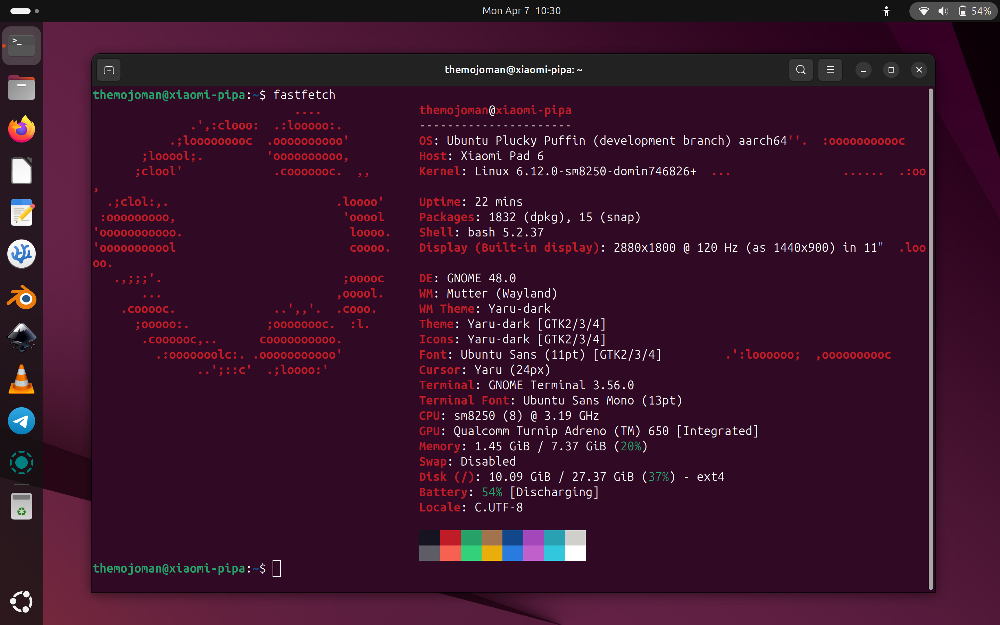

# xiaomi-pipa
Linux disk images, kernels and scripts for the Xiaomi Pad 6 tablet (codename: pipa).

# Ubuntu Linux on the Xiaomi Pad 6 (pipa)

## THANKS
First, I would like to thank the following people for their excellent work in developing the Linux kernel for the Xiaomi Pad 6. Without them this would all not be possible:
 - Dominik Sitarski <https://github.com/domin746826>
 - vipaoL <https://github.com/vipaoL>
 - adomerle <https://github.com/adomerle>
 - Danila Tikhonov <https://github.com/JIaxyga>
 - luka177 <https://github.com/luka177>
 - Teguh Sobirin <https://github.com/tjstyle>
 - lujianhua <https://github.com/lujianhua>
 - map220v <https://github.com/map220v>
 - maverickjb <https://github.com/maverickjb>

Their work is based upon the shoulders of giants. So, thanks to the Linux kernel team, the Ubuntu team, the Gnome and KDE team and all the people that contributed to the many programs that are used in this distribution!

Additional thanks to the friendly people at the telegram group "Xiaomi Pad 6 Mainline Linux": t.me/pipa_mainline

## Installation
 - Backup your data from Android!!! You will most probably loose your Android and have to reinstall it. Continue at your own risk!
 - First you need to shrink the "userdata" partition of your internal drive of the Xiaomi Pad 6 and create two additional partitons named "esp" and "linux". There are several ways to do it. You can e.g. follow this guide [here](https://xdaforums.com/t/pipa-how-to-install-windows-11-on-xiaomi-pad-6.4647419/). Only download the TWRP and then follow the "Making Windows Partitions" -> Non-GUI Method guide. In step 6: instead of creating a windows partition you should create a linux partition. The command could e.g. be "mkpart ext4 linux 224GB 253GB" if you would like to create a 30GB big partition at the end of the drive.
 - Next, download the root image file for Ubuntu and the boot loader. You can find it in the Ubuntu folder [here](https://mega.nz/folder/TZ9wwaIQ#Ojwu-1KhPyaYv7QwBaJQlQ/folder/aQFH3RqC).
 - Enter fastboot (see XDA forum guide above or power-on tablet with volume-down key being pressed).
 - Check the active slot: fastboot getvar current-slot
   If it prints "a" you need to install the boot loader to boot_b, if it prints "b" you need to install the boot loader to boot_a.
 - Delete dtbo: fastboot erase dtbo_b (or "fastboot erase dtbo_a", if you are on slot b).
 - Install Ubuntu root system: fastboot flash linux root.img
 - Install boot loader: fastboot flash boot_b boot_linux_6.12.0_1.img (or "fastboot flash boot_a boot_linux_6.12.0_1.img" if you are on slot b)

## Post-Installation
(If you have not connected to the internet than do it now.)
Open a terminal and
 - type "cat .bashrc_aliases". This shows you a list of shortcuts that I have defined for typing less. You can add your own shortcuts by editing the file with "nano .bashrc_aliases". Do your changes. Save with "Ctrl+s". Quit with "Ctrl+q".
 - Update the package list: "sudo apt update" (shortcut: "sau").
 - Upgrade the packages (if there are updates available): "sudo apt upgrade" (shortcut: "saug").

You might want to install some common apps:
 - Install Firefox browser: "sudo apt install firefox" (shortcut: "sai firefox").
 - Install the Ubuntu app store: "sudo snap install snap-store" (shortcut: "ssi snap-store").

## Updates
Kernel updates will be posted here because they are not hosted in Ubuntu's official repositories. You might join the dedicated telegram group to stay informed: t.me/pipa_mainline

If you have further question regarding Linux and Ubuntu please search the internet because there are many good forums and websites out there that will help you.

## Final note
Last but not least and most importantly: Have fun with your new ultra-portable computer!
