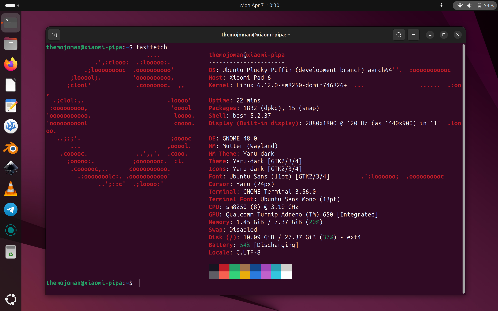

# 本文档基于英文版翻译，部分内容已适配中文用户习惯  
# 小米平板6  
小米 Pad 6 平板电脑（代号：pipa）的 Linux 磁盘映像、内核和脚本。  

# 小米平板 6 上的 Ubuntu Linux （pipa）  
  

## 致谢  
首先，我要感谢以下人员（排名不分先后）在为 Xiaomi Pad 6 开发 Linux 内核方面的出色工作。没有他们，这一切都是不可能的：  
 - adomerle <https://github.com/adomerle>  
 - vipaoL <https://github.com/vipaoL>  
 - luka177 <https://github.com/luka177>  
 - Dominik Sitarski <https://github.com/domin746826>  
 - Danila Tikhonov <https://github.com/JIaxyga>  
 - Teguh Sobirin <https://github.com/tjstyle>  
 - lujianhua <https://github.com/lujianhua>  
 - map220v <https://github.com/map220v>  
 - maverickjb <https://github.com/maverickjb>  

本项目是在巨人的肩膀上构建的。因此，感谢 Linux 内核团队、Ubuntu 团队、Gnome 和 KDE 团队以及所有为本发行版中使用的许多程序做出贡献的人！  

还要感谢电报组“Xiaomi Pad 6 Mainline Linux”提供的帮助: t.me/pipa_mainline  

## 刷机教程  
 - **一、准备工作**  
   - 刷机不备份，变砖两行泪。开始前，请先备份数据，同时确保bootloader已解锁。刷机失败的风险请自己承担！  
   - 备份完成后使用数据线连接电脑和手机  
   - 连接完成后在特定目录打开终端  
   - 配置adb和fastboot环境:  
     - 对于使用apt包管理器的Linux，执行命令：  
       ```bash
       sudo apt install adb android-sdk-platform-tools
       ```  
     - 对于Windows或者Mac: [点我下载adb和fastboot](https://developer.android.com/tools/releases/platform-tools).  

 - **二、开始刷机**  
   - **1. 分区调整**  
     - 在这个链接里面找到并下载 TWRP 文件 [点我跳转](https://xdaforums.com/t/pipa-how-to-install-windows-11-on-xiaomi-pad-6.4647419/).  
     - 进入fastboot后执行：  
       ```bash
       fastboot flash boot boot_partitions.img  # 刷入twrp(recovery镜像)
       fastboot reboot recovery                # 重启到recovery
       ```  
     - 在TWRP中执行（若花屏可盲输）：  
       ```bash
       adb shell
       setenforce 0                            # 临时关闭 SELinux
       sgdisk --resize-table 64 /dev/block/sda
       parted /dev/block/sda                   # 启动分区编辑器
       ```  
     - 在`parted`交互界面中输入：  
       ```
       print                                  # 查看分区信息（截图保存）
       rm <Number>                            # 删除userdata分区（如rm 34）
       mkpart userdata ext4 <Start> <End / 2> # 创建新userdata分区（如11.1GB 63GB）
       mkpart esp fat32 <End / 2> <End / 2 + 512MB>  # 创建esp分区（如63GB 63.5GB）
       mkpart linux ext4 <End / 2 + 512MB> <End>    # 创建linux分区（如63.5GB 126GB）
       print                                  # 确认esp分区号
       set <Number> esp on                   # 设置esp分区标志（如set 35 esp on）
       quit                                   # 退出parted
       ```  
     - 后续命令：  
       ```bash
       reboot recovery                       # 重启到recovery
       adb shell
       twrp format data                      # 格式化
       reboot bootloader                     # 重启到fastboot
       ```  

   - **2. 刷入Ubuntu**  
     - 下载镜像解压出`root.img`和`boot_linux.img`  
     - 在fastboot中执行：  
       ```bash
       fastboot getvar current-slot          # 检查当前槽位（输出a或b）
       fastboot erase dtbo_b                 # 若槽位是a则擦除dtbo_b（反之用dtbo_a）
       fastboot flash linux root.img         # 刷入根系统
       fastboot flash boot_b boot_linux.img  # 根据槽位刷入boot（如boot_b或boot_a）
       fastboot set_active b                 # 激活对应槽位（如b或a）
       fastboot reboot                       # 重启
       ```  

## 安装后（简单食用教程）  
  请先连接到网络  

**终端操作**：  
 - 命令补全：按 `Tab` 键自动补全  
 - 输入 'cat .bash_aliases'，将会显示快捷命令。可以节省输入！
   
 - 您可以通过使用 'nano .bash_aliases' 编辑该文件来自定义自己的快捷命令。自定义完成后。使用 “Ctrl+s” 保存。使用 “Ctrl+q” 退出。
 - 更新软件包列表：'sudo apt update'（也可以使用快捷命令：'sau'）。
 - 升级软件包（如果有可用的更新）：'sudo apt upgrade'（快捷命令：'saug'）。
 - 注意：'sudo' 命令可获得超级用户 （root） 权限。只有超级用户 （root） 才能安装新软件。所以安装软件要加sudo作为前缀。

您可能需要安装一些常见的应用程序：
 - 安装 Firefox 浏览器：'sudo apt install firefox'（快捷：'sai firefox'）。
 - 安装 Ubuntu 应用商店：'sudo snap install snap-store'（快捷：'ssi snap-store'）。

## 更新
内核更新将在此处发布，因为它们未托管在 Ubuntu 的官方存储库中。您可以加入专门的电报组以随时了解情况：t.me/pipa_mainline

如果您对 Linux 和 Ubuntu 有进一步的问题，请在互联网上搜索，因为那里有许多论坛和网站可以为您提供帮助。

## 最后说明
Most importantly: 😀 **Have fun with your new ultra-portable computer!** 😀
